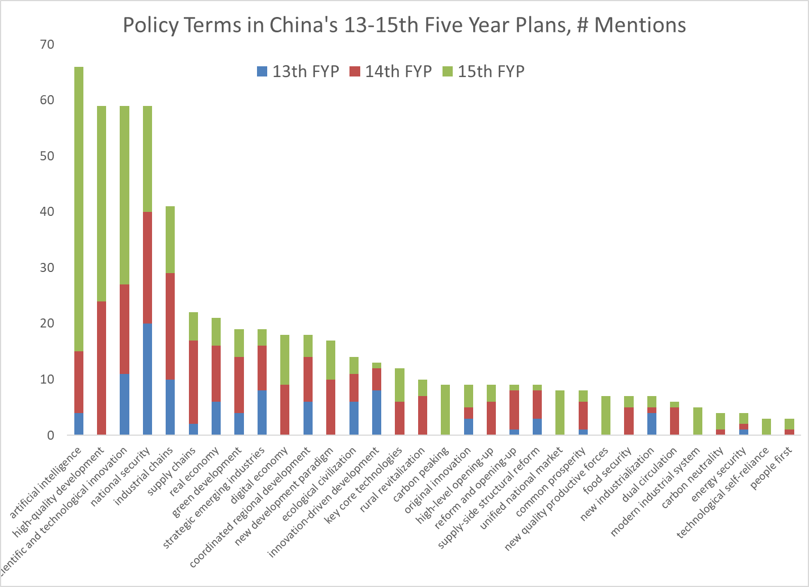

2026 03 15

*This essay is crossposted from [Substack](https://lambheart.substack.com/p/ai-management-in-chinas-15th-five).*

On March 13, 2026, China released its [15th Five-Year Plan](https://www.news.cn/politics/20260313/085af5de5a4b4268aa7d87d90817df2f/c.html) ([trans.](https://file.notion.so/f/f/ef46bda8-6bca-8153-97c2-000307111340/472e6b73-9a5f-4888-be19-4fab129e4de1/China_15th_Five-Year_Plan_(English).pdf?table=block&id=3236bda8-6bca-8037-994e-dc7bc9929b14&spaceId=ef46bda8-6bca-8153-97c2-000307111340&expirationTimestamp=1773583200000&signature=REUDA95TyfE-t4Mk-qYwosfA2MFLytFDSfogJxoUdZo&downloadName=China+15th+Five-Year+Plan+%28English%29.pdf))—a 70-page strategy document governing national economic and social development through 2030. Two aspects stand out with regards to AI governance: the comprehensiveness of the acceleration agenda, and its risk management approach to AI governance. The plan promotes expansion of computing resources, frontier research, and “AI+” industry applications at scale. Its governance priorities, by contrast, are genealogically derived from standard emergency management frameworks and primarily concerned with information governance and social stability. Rather, the larger emphasis on new-quality productive forces and acceleration follows a Marxist political economy argument: that governance, as superstructure, must adapt to the development of productive forces rather than constrain them. For the sake of providing vital context, I will expound on the AI governance architecture and foundational claims of the 15th FYP.

Artificial intelligence has a pronounced presence in the strategy document alongside a sustained focus on scientific and technological innovation (科技创新), high-quality development (高质量发展), and national security (国家安全). Characterized by an acceleration agenda, the document argues for industrial policy that promotes the development and comprehensive strategic planning of frontier scientific and technological development, so as to realize the revolution in productive forces that artificial intelligence presents.

<figure>
  
  <figcaption>
    (Source: <a href="https://x.com/berthofmanecon/status/2031593946921791678?s=20" target="_blank" rel="noopener">@berthofmanecon on Twitter/X</a>)
  </figcaption>
</figure>

A notable term, new-quality productive forces (新质生产力), is a conceptual innovation by Xi introduced in a September 2023 inspection speech in Heilongjiang, and serves as the conceptual foundation for the plan’s AI industrial policy. The term extends off of the classical Marxist productive forces framework to emphasize advanced manufacturing and AI as a qualitatively new historical phase of productive forces, just as steam power during industrialization, as distinct from innovation-driven development (创新驱动发展) more central to the 13th FYP.

Similarly, scientific and technological self-reliance (科技自立自强) is a Xi extension off of Qing and Maoist ideological lines, wherein the political argument is that technological dependency gives way to the vulnerabilities of China’s century of humiliation. The compound phrase consists of 自立 (self-reliance), from Maoist thought, and 自强 (self-strengthening), from the nineteenth-century Qing state Self-Strengthening Movement (自强运动), which sprung up in response to the military and industrial superiority of the British Empire in the Opium Wars. However, the genealogy of 自强 traces back further to the first hexagram (乾卦) of the Classic of Changes (周易) from the Western Zhou period: “As the heavens move with ceaseless vigor, the noble man must always strive towards self-strengthening. (天行健，君子以自强不息。)”

AI governance concerns of the 15th FYP are as follows (combination of direct quotes and paraphrasing):

- Comprehensively coordinate the expansion of accessible, green, large-scale computing infrastructure and conduct feasibility studies for hyperscale intelligent computing clusters (Chapter 12, Section 1)
- Promote technological breakthroughs in artificial intelligence. Establish and perfect a model capability evaluation system (Chapter 12, Section 2)
- Build a national data resource system, sharing government data and public data, and promoting the opening of enterprise and industry data. Accelerate the construction of high-quality datasets. Improve the responsibility systems and mechanisms for the development and reasonable usage of public and personal data, specifically in AI training as well. (Chapter 12, Section 3; Chapter 14, Section 1)
- Continue the AI+ initiative, strengthening the integration of AI with technological innovation, industry, and society. (Chapter 13)
- Improve governance, standards, and ethical guidelines for AI (Chapter 14, Section 2).
  - Exploration of rules for determining the ownership of AI-generated content.
  - Exploration of the rights and responsibilities of developers, operators, and users.
  - Promote the establishment of a full lifecycle risk management system for AI and improve a risk prevention and control system covering security monitoring, risk warning, and emergency response.
  - Crack down on data abuse, deepfakes, and privacy leaks.
- Actively participate in international governance on AI and promote the establishment of an international governance framework (Chapter 14, Section 3; Chapter 24, Section 1).
- Support Global South countries in strengthening their AI capabilities (Chapter 14, Section 4).
- Address the impact of artificial intelligence on employment toward a high-quality and full employment-first policy (Chapter 41, Section 1).

Delving deeper into Section 2 of “Chapter 14: Creating a Healthy and Orderly Development Ecosystem”, several clauses warrant closer attention.

“We will improve the safety supervision framework for new technologies and new business models, establish a mechanism for the development and adjustment of technical standards and the hierarchical management of technology applications, and promote multi-party collaborative governance. (健全新技术新业态安全监管框架，构建技术标准研制调整、技术应用分级管理机制，推进多元协同共治。)”

The term for hierarchical management (分级管理机制; also: 分级分类管理) refers to operative criteria—defined by the type of generated content, social reach, and relevance toward national security—that determines the classification and management of services. In other words, the hierarchical management explicated within the document is based on more social impact rather than technical risks. Although the document refers to national security as a concern with regards to AI, in practice, security assessments and national security mentions in AI regulatory requirements refer primarily to content safety and data security. However, the aspirational language of “establish (构建)” prevents us from being certain of the outcome from this phrase, and it will only be determined upon actual implementation of regulations.

The sentence requiring the most contextual explanations, I believe, is what follows a sentence later:

“We will promote the establishment of a full lifecycle risk management system for artificial intelligence and improve a risk prevention and control system covering security monitoring, risk warning, and emergency response. (推动建立人工智能全生命周期风险管理制度，健全覆盖安全监测、风险预警、应急响应的风险防控体系。)”

What exactly does “a full lifecycle risk management system” and the “risk prevention and control system” described here imply? If we trace the genealogy of these terms, the tripartite formula of security monitoring (安全监测), risk warning (风险预警), and emergency response (应急响应) here appears across various domains of Chinese governance, and is a standard monitoring-warning-response emergency management [framework](https://www.mem.gov.cn/xw/jyll/200602/t20060220_230269.shtml) established in 2006 that is applied in cybersecurity, data security, and even public health crises—namely, [COVID-era governance](https://www.qstheory.cn/dukan/qs/2020-03/01/c_1125641735.htm). Thus, the framework proposed here is a pre-existing approach not unique to AI risks. Whether this system, when fully realized, incorporates dangerous capability evaluations will depend more on the subordinate implementing agencies and the influence of China’s AI safety research community. For now, the focus remains on political stability and social impact.

The natural follow-up question is whether acceleration is directed toward AGI/ASI as the current Western literature understands it. Embedded in this question are two distinct concerns: whether AGI is explicitly targeted as a strategic objective, and whether the material investments and stated priorities structurally accelerate capabilities toward the direction of AGI, regardless of intent.

As summarized above, I would maintain that, no, the 15th FYP frames AI goals in terms of industrial competitiveness, applications, and self-reliance; thus, they do not indicate preference towards pursuing AGI. At most, the document promotes broad exploration of different research directions (探索通用人工智能发展路径), such as AI agents (智能体), embodied intelligence (具身智能), swarm intelligence (群体智能), general-purpose large models (通用大模型; note: not artificial general intelligence; further reading by IAPS [Karson Elmgren](https://logogram.substack.com/p/no-the-2017-new-generation-ai-development)), and industry-specific models (行业专用模型). The main verb here, 探索 (explore), is tentative rather than being narrowed to a specific research direction (Chapter 12, Section 2). Structurally, the acceleration agenda is not orthogonal to AGI development. Regardless of stated objectives, talent cultivation, strategic investment, and research trajectories point toward strengthening computational and research infrastructure and frontier capabilities development, which themselves arguably constitute a pathway to AGI. However, the reactive governance approach explicated is notably disjoint from the accelerating capability trajectory.

At its core, it appears as though the Chinese government is not engaging in preemptive governance measures. In the guiding principles section, the document reaffirms that governance must promote better adaptation between the relations of production and productive forces, the superstructure and economic base, and national governance and social development (“...推动生产关系和生产力、上层建筑和经济基础...”), pulling directly from classical Marxism, wherein governance, as superstructure, and the relations of production must both adapt to the development of productive forces, the economic base. In other words, governance constraints should not outpace and preempt the revolution of productive capabilities. Adaptation towards accelerating change is the core principle.

Notably, the 15th FYP makes no mention of capability thresholds, autonomous decision-making, emergent capabilities, misalignment, and risks unique to frontier models or multi-agent models. While the plan makes commitments toward international cooperation in AI governance, it does not mention any specific international coordination mechanism for addressing capability risks either. It is important to keep in mind the caveat that the five-year plan represents a settled consensus on overarching strategy. This means it does not encompass the full range of elite deliberation or granular regulation concerns. However, an apt genre comparison may be the EU AI Act, which in contrast contains explicit provisions for capability thresholds.

It is better to understand the five-year plan’s notable omission of a capability risk framing as the central government’s incentives to promote AI as an opportunity for development, given its primary audience of lower-level local governments and state enterprises who need to execute the acceleration agenda. With broad national priorities and KPIs set by the central government, local governments experiment with a wide range of implementations and policies to compete on execution of abstract goals. When risks and concerns arise, a relevant central government agency may intervene with regulatory guidance. In other words, downsides are contained reactively. This is essentially how the incentive structure of Chinese governance works. One may recall the central government’s [warnings](https://mp.weixin.qq.com/s/4Ds8wa_iSgSvnNwH2DfaDw) against OpenClaw, which were released after several municipal governments—such as those of Shenzhen, Wuxi, and Hangzhou—promoted its use toward the general public ([further discussion](https://x.com/AngelicaOung/status/2031757405915091121)). The most consequential question for the AI safety community, thus, is whether the implementing regulations the 15th FYP calls upon will take capability risks into consideration. In the meantime, nothing in the document strongly suggests technical risks are taken into consideration in national AI strategy.